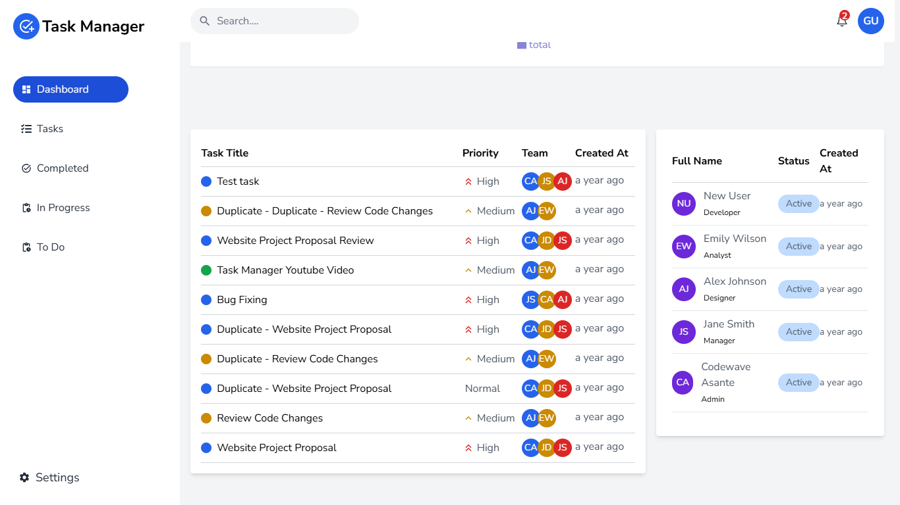
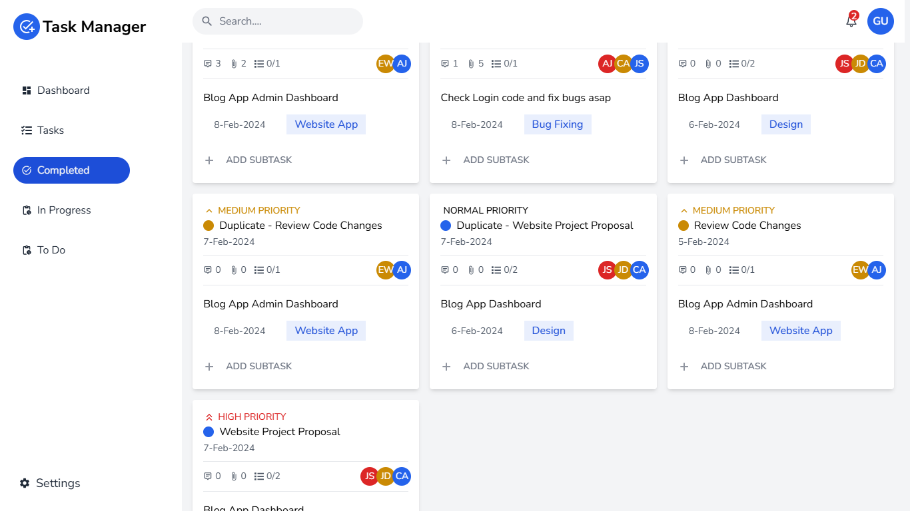

# Fullstack Task Manager (MERN)

### 🔗 **Live preview** of the project is [[here](https://taskmanagetool.netlify.app/dashboard]

# Overview
The Cloud-Based Task Manager is a web application designed to streamline team task management. Built using the MERN stack (MongoDB, Express.js, React, and Node.js), this platform provides a user-friendly interface for efficient task assignment, tracking, and collaboration. The application caters to administrators and regular users, offering comprehensive features to enhance productivity and organization.

### Why/Problem?
In a dynamic work environment, effective task management is crucial for team success. Traditional methods of task tracking through spreadsheets or manual systems can be cumbersome and prone to errors. The Cloud-Based Task Manager aims to address these challenges by providing a centralized platform for task management, enabling seamless collaboration and improved workflow efficiency.

### **Background**:
With the rise of remote work and dispersed teams, there is a growing need for tools that facilitate effective communication and task coordination. The Cloud-Based Task Manager addresses this need by leveraging modern web technologies to create an intuitive and responsive task management solution. The MERN stack ensures scalability, while the integration of Redux Toolkit, Headless UI, and Tailwind CSS enhances user experience and performance.

### 
## **Admin Features:**
1. **User Management:**
    - Create admin accounts.
    - Add and manage team members.

2. **Task Assignment:**
    - Assign tasks to individual or multiple users.
    - Update task details and status.

3. **Task Properties:**
    - Label tasks as todo, in progress, or completed.
    - Assign priority levels (high, medium, normal, low).
    - Add and manage sub-tasks.

4. **Asset Management:**
    - Upload task assets, such as images.

5. **User Account Control:**
    - Disable or activate user accounts.
    - Permanently delete or trash tasks.

## **User Features:**
1. **Task Interaction:**
    - Change task status (in progress or completed).
    - View detailed task information.

2. **Communication:**
    - Add comments or chat to task activities.

## **General Features:**
1. **Authentication and Authorization:**
    - User login with secure authentication.
    - Role-based access control.

2. **Profile Management:**
    - Update user profiles.

3. **Password Management:**
    - Change passwords securely.

4. **Dashboard:**
    - Provide a summary of user activities.
    - Filter tasks into todo, in progress, or completed.

## **Technologies Used:**
- **Frontend:**
    - React (Vite)
    - Redux Toolkit for State Management
    - Headless UI
    - Tailwind CSS

- **Backend:**
    - Node.js with Express.js
    
- **Database:**
    - MongoDB for efficient and scalable data storage.

The Cloud-Based Task Manager is an innovative solution that brings efficiency and organization to task management within teams. By harnessing the power of the MERN stack and modern frontend technologies, the platform provides a seamless experience for both administrators and users, fostering collaboration and productivity.

&nbsp;

## SETUP INSTRUCTIONS

# Server Setup

## Environment variables
First, create the environment variables file `.env` in the server folder. The `.env` file contains the following environment variables:

- MONGODB_URI = `your MongoDB URL`
- JWT_SECRET = `any secret key - must be secured`
- PORT = `8800` or any port number
- NODE_ENV = `development`

&nbsp;

## Set Up MongoDB:

1. Setting up MongoDB involves a few steps:
    - Visit MongoDB Atlas Website
        - Go to the MongoDB Atlas website: [https://www.mongodb.com/cloud/atlas](https://www.mongodb.com/cloud/atlas).

    - Create an Account
    - Log in to your MongoDB Atlas account.
    - Create a New Cluster
    - Choose a Cloud Provider and Region
    - Configure Cluster Settings
    - Create Cluster
    - Wait for Cluster to Deploy
    - Create Database User
    - Set Up IP Whitelist
    - Connect to Cluster
    - Configure Your Application
    - Test the Connection

2. Create a new database and configure the `.env` file with the MongoDB connection URL. 

## Steps to run server

1. Open the project in any editor of choice.
2. Navigate into the server directory `cd server`.
3. Run `npm i` or `npm install` to install the packages.
4. Run `npm start` to start the server.

If configured correctly, you should see a message indicating that the server is running successfully and `Database Connected`.

&nbsp;

# Client Side Setup

## Environment variables
First, create the environment variables file `.env` in the client folder. The `.env` file contains the following environment variables:

- VITE_APP_BASE_URL = `http://localhost:8800` #Note: Change the port 8800 to your port number.
- VITE_APP_FIREBASE_API_KEY = `Firebase api key`

## Steps to run client

1. Navigate into the client directory `cd client`.
2. Run `npm i` or `npm install` to install the packages.
3. Run `npm start` to run the app on `http://localhost:3000`.
4. Open [http://localhost:3000](http://localhost:3000) to view it in your browser.

&nbsp;

## For Support, Contact:

- Email: codewavewithasante@gmail.com
- Telegram Chat: [https://t.me/Codewave_with_asante](https://t.me/Codewave_with_asante)